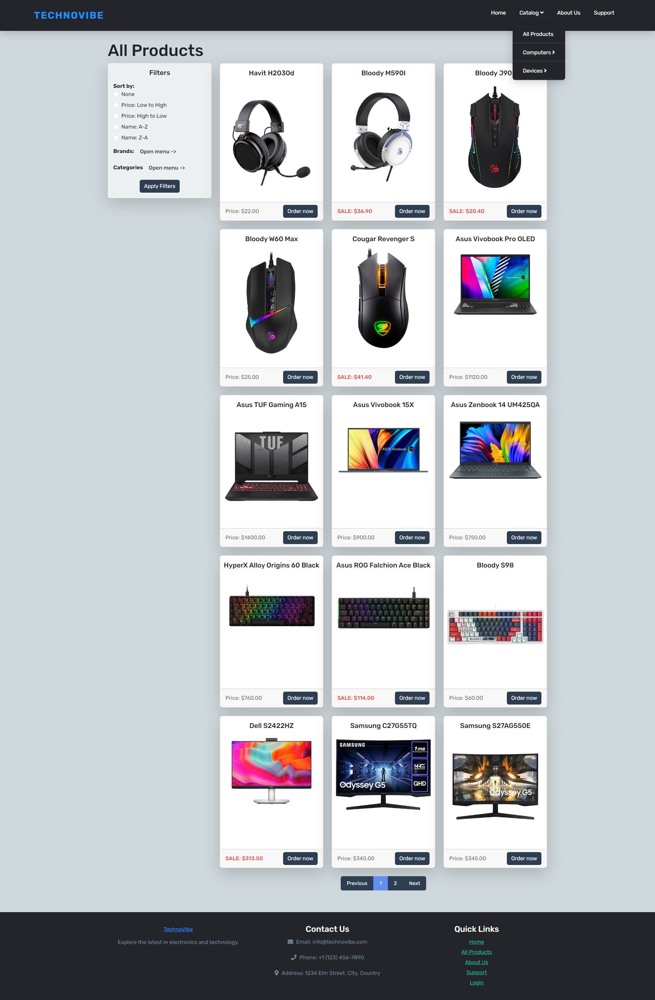
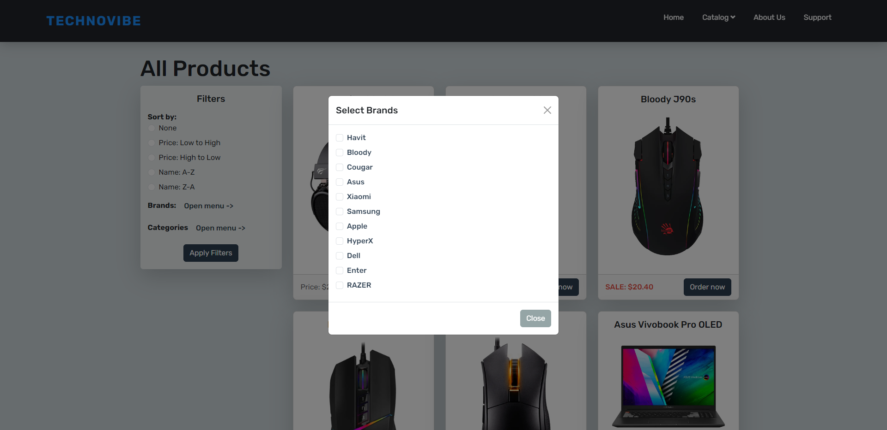
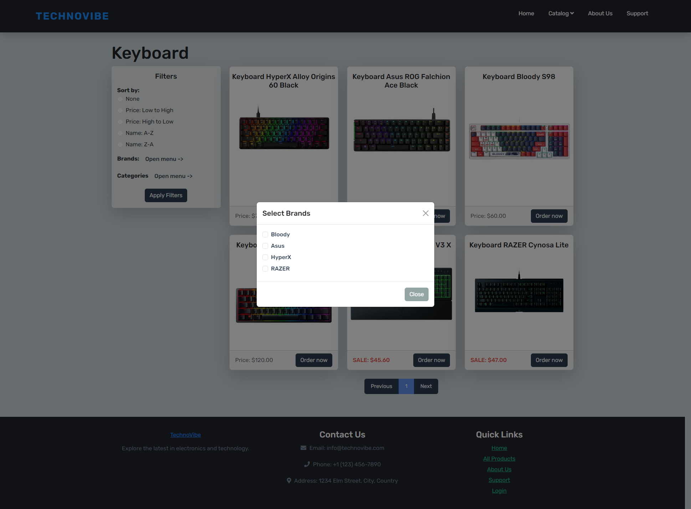
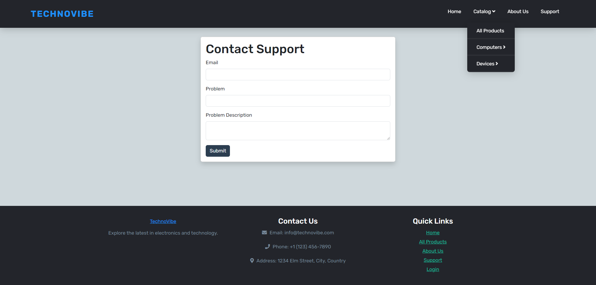
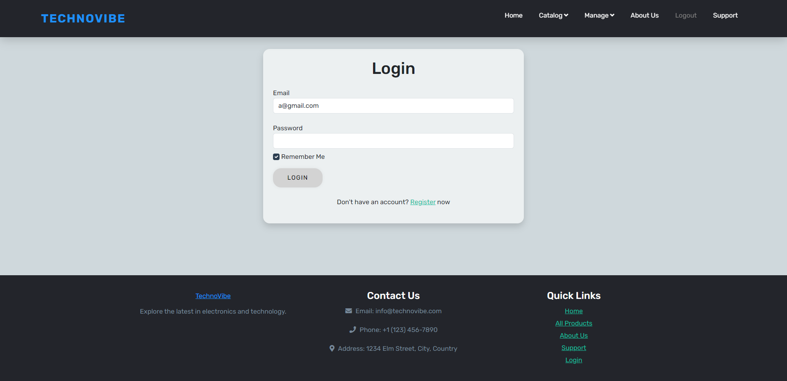
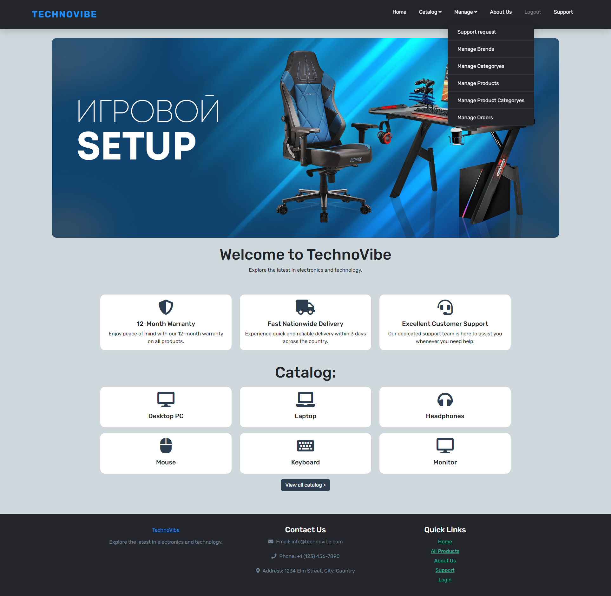
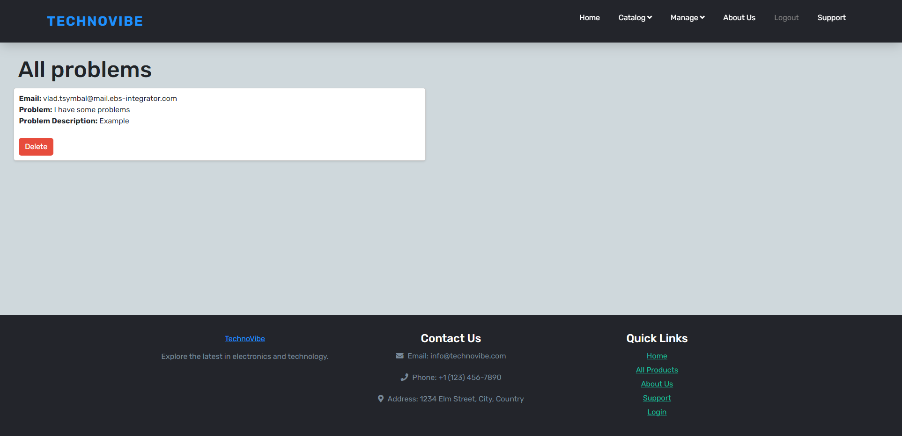
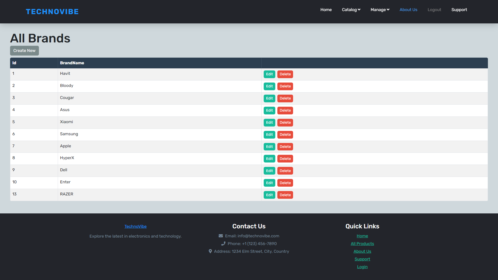
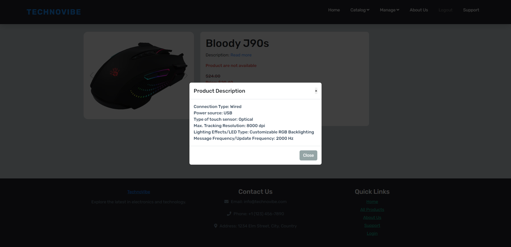

### Project Overview:
Project Name: **TechnoVibe**                    
Creation Date: **August 2023**

Technologies used in this project: 
C# .NET, ASP.NET MVC, 
Entity, Identity framework - for working with database, 
Vertical slices - for grouping the project structure and methods, 
Patterns: CQRS, MediatR, 
Lazy cache - for caching data 

