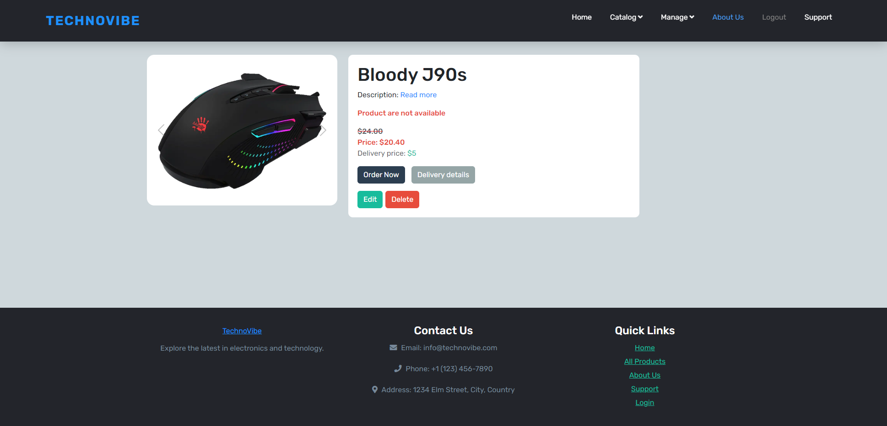

### Project Overview:
Project Name: **TechnoVibe**                    
Creation Date: **August 2023**

Technologies used in the project:.
C# .NET, ASP.NET MVC,.
Entity, Identity framework - for working with database,.
Vertical slices - for grouping the project structure and methods,.
Patterns: CQRS, MediatR,.
Lazy cache - for caching data.

